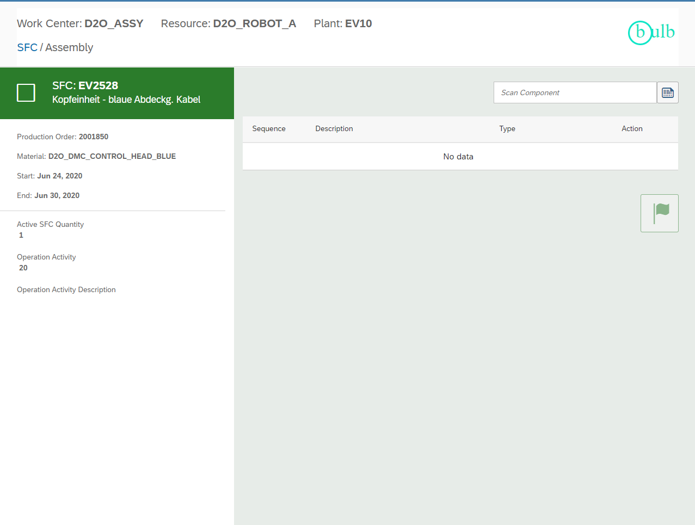
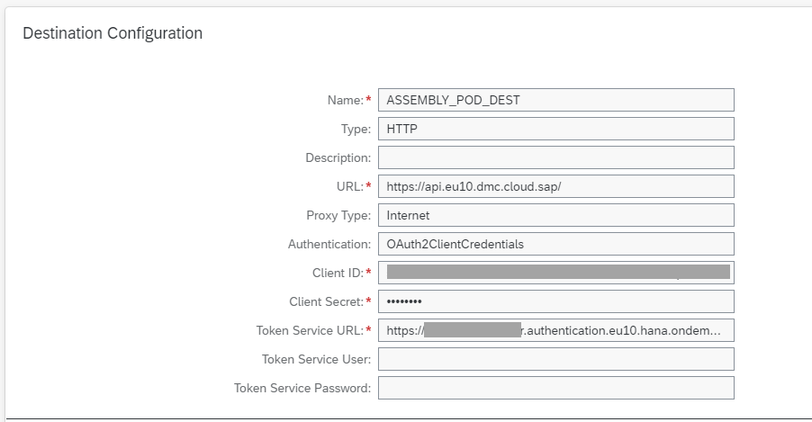
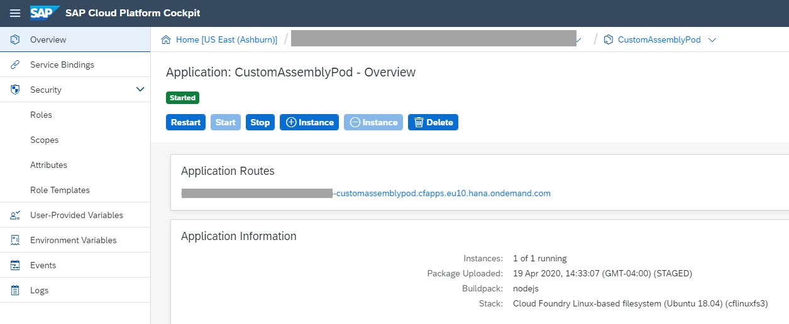

# AssemblyPOD

The Assembly Template POD is a UI5 application designed to allow assembly operations for a single SFC
at an active operation step. It utilizes public APIs published to the Public API Hub for accessing
microservices in SAP Digital Manufacturing Cloud for execution. Customers and partners can import the
Assembly Template POD into Web IDE, make modifications as needed, and deploy it to their PaaS
account. 

# Pre-requisites
1. SAP Cloud Platform Account
2. SAP Cloud Platform subaccount Entitlement for Application Runtime
3. SAP Cloud Platform subaccount Entitlement for Destination

#### Template Assembly POD Landing Page

#### Template Assembly POD Detail Page

# Getting Started

Please check [SAP Help Portal - Digital Manufacturing Cloud](https://help.sap.com/viewer/product/SAP_DIGITAL_MANUFACTURING_CLOUD/latest/en-US "SAP Help Portal - Digital Manufacturing Cloud") for general information.

The major steps are:
#### 1. Prepare your Editor  
Clone the repository to your editor and build the application. SAP WebIDE provides easy build and deploy capability to SCP but this can be achieved with local editors as well. 
#### 2. Configure the Destination 
Create a destination in the SAP Cloud Platform tenant, please refer the following screenshot for sample values. The destination name should match with the name given in xs-app.json file. The credentials can be fetched from the service key of Digital Manufacturing Cloud instance in your SAP Cloud Platform Account.  

#### 3. Deploy to your SAP Cloud Platform Tenant
After building the application the MTAR file will be available in the mta_archieves folder which can be deployed to SAP Cloud Platform.

#### 4. Run the Application with the URL parameters
Build the application url adding the appropriate URL parameters
https://<APP_URL>?WORK_CENTER=<>&RESOURCE=<>&PLANT=<>.
  
# 2D Barcodes for Assembling Components

The Assembly page provides an input field for scanning ISO 15434 barcodes. There are issues with
scanning ISO 15434 barcodes with several major browsers that cause browser shortcut keys to be
invoked. For that reason, the following control character sequences should be used by barcodes used by
the Assembly Template POD.

| Code Type      | Control Character      | Replacement Control Characters |
| -------------- | ---------------------- | ------------------------------ | 
| Group Separator | <GS> ASC 29 | {GS} |
| Record Separator | <RS> ASC 30 | {RS} |
| End of Transmission | <EOT> ASC 4 | {EOT} |
  
Additional scan codes that must be included are defined below.

| Code Type      | Control Characters      | 
| -------------- | ---------------------- | 
| Scan Header  |   |
| Data Format | 06 |

The following data types are supported using the ISO 15434 types defined below

| Data Type      | Prefixes      | 
| -------------- | ---------------------- | 
| COMPONENT  | 19P |
| SERIAL_NUMBER | 15S, 18S, 2C, S, 1S |
| LOT_NUMBER | T, 1T|
| COMMENTS | 11Z, 12Z, 13Z |
| SFC | 1FC |
| INVENTORY_ID_SFC | 1IS |

The scan must include the header of “” as well as the data format “06” to be interpreted properly.
See example barcode below:
06{GS}11ZComment Test{GS}19PBRACKET{GS}T002_LOT{GS}15S1234-ES{RS}{EOT}
Will return the following information:

COMPONENT: BRACKET
COMMENT: Comment Test
LOT_NUMBER: 002_LOT
SERIAL_NUMBER: 1234-ES

The COMPONENT data field is required in the Assembly Template POD. If it is not provided an error will display.

## How to obtain support
If you have issues with this sample, please open a report using [GitHub issues](../../../../../issues).

## License
Copyright © 2020 SAP SE or an SAP affiliate company. All rights reserved.
This file is licensed under the SAP Sample Code License except as noted otherwise in the [LICENSE file](../../../LICENSE).
